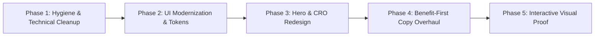

# Deep-Dive Evaluation & Industry Critique: ZINAD Core Solutions & Platforms

> [!IMPORTANT]
> This evaluation provides a rigorous, senior-level audit of the **7 Core Solutions and Platform pages** on **ZINAD** (`https://zinad.net/`). It evaluates each page through four critical lenses:
> 1. **UI/UX Design & Visual Architecture** (hierarchy, layout, typography, accessibility, responsive behavior).
> 2. **Marketing, Messaging & Copywriting** (value proposition, persona alignment, pain-point framing, tone, trust signals).
> 3. **Conversion Rate Optimization (CRO)** (CTA placement, friction, customer journey, intent capture).
> 4. **Cybersecurity Industry Standard Benchmark** (evaluated against Tier-1 peers such as KnowBe4, Hoxhunt, SoSafe, and Proofpoint).

---

## 1. Executive Scorecard: 7 Core Solution Pages

| # | Page / Solution | Route | UI/UX Score | Marketing & Copy | CRO / Funnel | Industry Alignment | Overall Grade |
|:---|:---|:---|:---:|:---:|:---:|:---:|:---:|
| **1** | **Primary Landing Portal** | `/` | 5.5 / 10 | 5.0 / 10 | 4.5 / 10 | 5.0 / 10 | **C-** |
| **2** | **All Products Overview** | `/all-products` | 3.5 / 10 | 3.0 / 10 | 2.5 / 10 | 3.0 / 10 | **D** |
| **3** | **ZiSoft (Human Threat Intel)** | `/product-zisoft` | 6.0 / 10 | 6.0 / 10 | 5.0 / 10 | 5.5 / 10 | **C** |
| **4** | **ZIGAMES (VR & Kinect)** | `/zi-games-page` | 6.5 / 10 | 5.5 / 10 | 4.0 / 10 | 6.0 / 10 | **C+** |
| **5** | **Awareness Campaigns** | `/products-cybersecurity-awarness-campaigns` | 6.0 / 10 | 5.0 / 10 | 4.0 / 10 | 5.0 / 10 | **C** |
| **6** | **CSS (Crowdsourced Security)** | `/product-css.html` | 4.5 / 10 | 4.0 / 10 | 3.5 / 10 | 4.0 / 10 | **D+** |
| **7** | **Evenue Platform** | `/product-evenue.html` | 5.0 / 10 | 4.5 / 10 | 3.5 / 10 | 4.5 / 10 | **C-** |

---

## 2. Systemic Deficiencies Across All 7 Core Pages

Before inspecting individual pages, several overarching architectural, technical, and branding bugs degrade the user experience across all 7 solutions:

### 2.1 DOM & SEO Pollution: The Rogue `<h2>Hi there!</h2>`
Every single solution page injects an identical `<h2>Hi there!</h2>` directly into the DOM tree. This is caused by an un-scoped conversational chatbot/live-chat widget.
- **The Issue**: Search engines treat `H2` elements as key semantic outlines of page content. When every product page shares an `H2` labeled `"Hi there!"`, keyword relevance and on-page SEO ranking suffer severely.
- **Fix**: The widget markup must be isolated inside a Shadow DOM, an iframe, or styled with `
` / `` without hijacking heading tags.

### 2.2 Preloader Friction (`#loading`)
The site enforces a full-screen white preloader overlay (`#loading`) with multi-layered spinning rings.
- **The Issue**: Modern B2B SaaS web standards prioritize **Core Web Vitals** (LCP - Largest Contentful Paint under 1.8s). Forcing a full-screen blocking overlay introduces artificial latency, degrades perceived performance, and increases bounce rates for mobile and executive visitors.
- **Fix**: Eliminate the full-screen blocker. Transition to native streaming SSR / SSG with skeleton loaders for dynamic async cards.

### 2.3 Editorial Quality & Linguistic Inconsistencies
Prominent typographical errors and awkward syntax appear directly in primary headings:
- Section header on multiple pages reads: `"AI-POWERED AWARENESS MANAGMENT SYSTEM"` (missing the second 'e' in *MANAGEMENT*).
- ZIGAMES subheader: `"We Introduce Security Awareness in Its New Suit!"` (literal translation artifact; grammatically awkward in English enterprise marketing).
- Plan selector copy: `"Choose a Suitable Plan That Meet Your Business Requirements."` (subject-verb agreement error: should be *Meets*).
- **Impact**: In cybersecurity, where trust and precision are the primary currency, spelling errors in hero headers create immediate doubts about software reliability.

### 2.4 Absence of Sticky / Primary Conversion Hooks
While there is a generic sticky header and a floating envelope icon, **none of the 7 core pages feature an explicit, primary hero CTA button** (such as *"Book a 15-Minute Demo"* or *"Explore Interactive Sandbox"*). Visitors are forced to read through walls of text before finding a pathway to purchase.

---

## 3. Surgical Page-by-Page Critique

---

### Page 1: Primary Landing Portal (`/`)

#### A. UI / UX Design & Visual Hierarchy
- **Hero Carousel Clutter**: The homepage relies on an auto-sliding banner carousel with 4 disparate slides (Black Hat 2025, Gartner Recognition, General Brand, AI Awareness). The slides contain text baked directly into raster image graphics, making the typography blurry on Retina displays and completely unreadable on mobile screens.
- **Visual Disconnection**: Below the slider, the page jumps abruptly to the `"HUMAN THREAT INTELLIGENCE"` section with heavy red serif-style underlines and trapezoidal cards with black/gray circle badges. The trapezoidal shape design language feels dated (circa 2012 skeuomorphic / corporate web) and clashes with modern flat/glassmorphic interfaces.
- **Hover Tooltips as Content Containers**: Crucial capability descriptions (e.g., what the *SMS Tips Module* or *Cyber Emissaries* actually do) are hidden inside hover tooltips. Mobile users on touch devices cannot hover reliably, meaning a large segment of visitors misses the entire value explanation.

#### B. Marketing & Copywriting
- **Weak Above-the-Fold Positioning**: The title tag reads `is a global leader in Cybersecurity Awareness and Human Threat Intelligence. | ZINAD` (omitting the brand name at the front).
- **Vague Value Proposition**: *"Create a proactive, pervasive culture where employees can recognize security risks and then act appropriately and professionally."* This is generic compliance language that could belong to any CBT vendor from 2015. It lacks a quantitative hook (e.g., *"Reduce human-factor breach risk by 78% in 90 days"*).
- **Audience Ambiguity**: Is this targeting a Fortune 500 CISO, an IT Director, or an HR training coordinator? The messaging waffles between technical red-teaming terms and basic HR checklist jargon.

#### C. Industry Standard Benchmark (vs KnowBe4 & Hoxhunt)
- **KnowBe4** leads with instant social proof: *"Over 70,000 organizations trust KnowBe4"* followed immediately by an interactive ROI calculator and free phishing test tool.
- **Hoxhunt** uses clean Nordic typography, showcasing real dashboard screens, employee behavior graphs, and interactive attack demonstrations.
- **ZINAD's Gap**: ZINAD hides its software screenshots! The landing page shows zero actual product interfaces, dashboards, or learner views. Visitors leave without knowing what the software looks like.

---

### Page 2: All Products Overview (`/all-products`)

#### A. UI / UX Design & Visual Hierarchy
- **Critical Failure - Zero Structural Identity**: This page is essentially an accidental clone of the landing page's middle section. It has **no `<h1>` tag**, no dedicated hero banner, and no introduction.
- **Dead-End Scroll**: The page drops the user immediately into the identical trapezoidal card carousel found on the homepage. There is no comparative matrix, no tier breakdown, and no feature-comparison table.
- **Lost Context**: A visitor clicking `"Solutions"` or `"All Products"` in the navigation expects a solution directory or platform ecosystem overview; instead, they see an amputated duplicate of the homepage.

#### B. Marketing & Copywriting
- **Total Absence of Product Storytelling**: There is zero copy explaining how ZINAD's products connect. Does ZiSoft feed data into ZIGAMES? Does Evenue link to Campaigns? The page fails to communicate that ZINAD offers an integrated platform rather than a disconnected grab-bag of tools.
- **No Pricing or Tier Guidance**: B2B buyers looking at an "All Products" page need guidance: *"Which package is right for my organization?"* (e.g., Enterprise vs Mid-Market vs Government). Nothing of this sort exists.

#### C. Industry Standard Benchmark (vs CrowdStrike & Proofpoint)
- **CrowdStrike Falcon Platform**: Offers an interactive "Platform Architecture" diagram where clicking a module shows its data ingest, analytics engine, and endpoint response.
- **ZINAD's Gap**: A missed opportunity to present an architectural diagram showing how **Human Threat Intelligence + AI Simulation + Offensive Red Teaming = Resilient Culture**.

---

### Page 3: ZiSoft Human Threat Intelligence (`/product-zisoft`)

#### A. UI / UX Design & Visual Hierarchy
- **Hero Graphic Quality**: The top hero graphic features generic, low-contrast vector illustrations of people with laptops. It looks like standard clip art rather than enterprise cybersecurity software.
- **Text-Heavy Feature Dump**: Following the hero, the page presents a massive monolithic paragraph: *"ZiSoft is more than just a learning management system and phishing assessment tool; it's a comprehensive cybersecurity awareness platform powered by AI..."*
- **Grid Monotony**: Below the wall of text, features are organized into repeated white rectangular cards with red icons. There is no visual pacing, no tabbed navigation, and no interactive UI screenshots of the admin console or employee reports.

#### B. Marketing & Copywriting
- **Feature-Centric Rather Than Benefit-Centric**: Headings read: *"AI-Powered Personalization"*, *"Automated Campaigns & Reminders"*, *"Gamified Learning & Rewards"*.
  - *Critique*: These describe what the feature *is*, not what the customer *achieves*.
  - *Better Alternative*: *"Eliminate 80% of Admin Overhead with Automated Phishing Journeys"*, *"Slash Click Rates on Executive Impersonation Using Real-Time Threat Feeds"*.
- **Buzzword Overload**: Overuse of "AI-Powered" without explaining the actual machine learning mechanics (e.g., Natural Language Generation of phishing templates? Reinforcement learning for difficulty adjustment? Behavioral NLP?). Sophisticated CISOs will dismiss this as marketing vaporware.

#### C. Industry Standard Benchmark (vs SoSafe & Cofense)
- **SoSafe**: Illustrates their Behavioral Science Framework with interactive cognitive bias examples and clear data visualization dashboards.
- **Cofense**: Demonstrates real-time email inbox integration buttons (*"Report Phishing"* add-in for Outlook and Gmail).
- **ZINAD's Gap**: ZiSoft claims "Enhanced Email Analyzer" and "Seamless Integration", but never shows the Outlook/Google Workspace add-in, the API schema, or the SOC webhook alerts.

---

### Page 4: ZIGAMES: Immersive & Experiential Learning (`/zi-games-page`)

#### A. UI / UX Design & Visual Hierarchy
- **Strong Imagery, Poor Typography**: This page has some of the most compelling photography on the site (actual VR headsets, users in tech hubs). However, the typography lets it down: text is aligned awkwardly against full-bleed photos with inconsistent line lengths (over 100 characters per line, violating readable typography standards of 50–75 characters).
- **Outdated Hardware References**: The page prominently promotes **"KINECT INTERACTIVE GAMES"**. Microsoft discontinued the Kinect hardware years ago. Promoting Kinect in 2025/2026 makes the product look neglected and technologically obsolete.

#### B. Marketing & Copywriting
- **Quoting Discredited Learning Statistics**: The copy states: *"As the human brain tends to remember 10% of what it reads, 20% of what it hears but 90% of what it does or simulates."*
  - *Critique*: This is the infamous, thoroughly debunked "Edgar Dale Cone of Experience" myth. Enterprise Chief Learning Officers (CLOs) and CISOs will immediately recognize this as pseudo-science.
  - *Better Alternative*: Reference verifiable modern learning science: spaced repetition, active recall, cognitive load theory, and gamified retention curves.
- **Awkward Tagline**: *"We Introduce Security Awareness in Its New Suit!"* Needs immediate replacement with crisp, modern phrasing: *"Experiential Cybersecurity: Immersive VR & Kinetic Simulations That Make Vigilance Muscle Memory."*

#### C. Industry Standard Benchmark (vs Living Security)
- **Living Security**: Offers "Cyber Escape Rooms" with high-production video trailers, measurable team vulnerability analytics, and enterprise team-building ROI.
- **ZINAD's Gap**: ZINAD has the unique advantage of VR and physical game assets, but offers **zero video gameplay demos**, zero hardware requirement specs, and no client case studies demonstrating enterprise deployment.

---

### Page 5: Cybersecurity Awareness Campaigns (`/products-cybersecurity-awarness-campaigns`)

#### A. UI / UX Design & Visual Hierarchy
- **Dark-on-Dark Contrast Issues**: The hero section uses a very dark, low-contrast digital hex-pattern background with deep red ambient lighting. Text overlay readability is compromised on standard office monitors.
- **Bizarre Merchandising Shift**: The page starts with high-stakes offensive security (**Red Teaming, Rogue APs, Keyloggers**) and then immediately transitions into selling **Posters, Calendars, Flipping Cards, Booklets, and "Giveaways/Gifts"**.
- **Perception Confusion**: Positioning high-end Red Teaming alongside corporate promotional trinkets creates massive cognitive dissonance. It dilutes ZINAD's offensive consulting authority.

#### B. Marketing & Copywriting
- **Missed Opportunity on Red Teaming**: The simulation activities (Vishing, Rogue APs, USB drops) are ZINAD's biggest competitive moat compared to pure-play software vendors like KnowBe4. Yet they are summarized in 4 terse cards with almost no methodology, safety controls, or reporting deliverables described.
- **Physical Collateral Positioning**: If physical materials are provided, they should be framed as *"Nudge Architecture"* or *"Environmental Security Triggers"*, not mere "Giveaways/Gifts".

#### C. Industry Standard Benchmark (vs Mandiant / Rapid7)
- **Mandiant / Rapid7 Social Engineering Services**: Explicitly outline engagement scopes: Reconnaissance -> Vector Execution -> Objective Demonstration -> Executive Debrief -> Remediation Roadmap.
- **ZINAD's Gap**: Lacks any sample report excerpts, executive dashboard previews, or rules-of-engagement assurances.

---

### Page 6: Crowdsourced Security Services - CSS (`/product-css.html`)

#### A. UI / UX Design & Visual Hierarchy
- **Visual Stagnation**: Extremely plain card layout. Looks like a generic corporate directory.
- **Broken Formatting**: Inconsistent spacing around parentheses in primary headers: `CSS ( Crowdsourced security services )`.
- **Iconography Mismatch**: Icons used for "Bug Bounty", "ZiLink", and "ZiCode" are generic flat vector icons that fail to convey the depth of an offensive security ecosystem.

#### B. Marketing & Copywriting
- **Target Audience Identity Crisis**: The copy states: *"serves the main important arms in cybersecurity industry: the Cybersecurity professionals, Researchers, customers and fresh graduates."*
  - *Critique*: Trying to be a platform for everyone (researchers, corporate clients, students, bug bounty hunters) guarantees you appeal to no one.
  - *Regional Copy Leakage*: The text specifically states *"enhance knowledge maturity of the Arabian cybersecurity personnel"*. While admirable for regional GCC development, when a global buyer from New York or Frankfurt lands on this page, it signals that the platform was not built for international enterprise deployment.
- **ZiLink Ambiguity**: Is ZiLink a private social network? A Slack community? A forum? The copy never clarifies what the product medium actually is.

#### C. Industry Standard Benchmark (vs HackerOne & Bugcrowd)
- **HackerOne**: Crystal-clear dual-sided marketplace positioning: *"For Organizations"* (Attack Surface Management, Pentesting, Bug Bounty) vs *"For Hackers"* (Leaderboards, Bounties, Education).
- **ZINAD's Gap**: Fails to explain triage SLA, vulnerability scoring (CVSS), payout mechanisms, or enterprise legal compliance.

---

### Page 7: Evenue: Interactive Event Platform (`/product-evenue.html`)

#### A. UI / UX Design & Visual Hierarchy
- **The "Screenshots" Section is Missing Real Screenshots**: The page has an `<h4>SCREENSHOTS</h4>` heading, but below it are abstract isometric graphic icons rather than actual high-resolution screenshots of the virtual platform halls, leaderboards, or session stages!
- **List Overload Without Context**: Features are dumped in a plain list: *"Admin Portal, User Profile, Dual language, Responsive design, Animated Halls, Customizable, Workshops, Interactive Games, Awareness Videos, Leaderboard, Notifications, Online help"*. This reads like a Jira sprint backlog rather than compelling product marketing.

#### B. Marketing & Copywriting
- **Value Proposition Failure**: What problem does Evenue solve? Why should an enterprise use Evenue instead of Zoom Events, Hopin, Microsoft Teams, or vFairs?
  - The copy fails to emphasize the *cybersecurity-specific* integrations (e.g., live CTF integration during keynotes, in-event phishing quizzes, automated attendance CPE credits).

#### C. Industry Standard Benchmark (vs Enterprise Event SaaS)
- **Modern Event SaaS (vFairs / Hopin)**: Features interactive 3D virtual tour video embeds, attendee capacity metrics, SOC2 compliance badges, and one-click demo sandbox links.
- **ZINAD's Gap**: Lacks any video walkthrough or live demo environment.

---

## 4. Competitive Benchmarking Matrix

| Feature / Standard | Industry Leaders (KnowBe4 / Hoxhunt / SoSafe) | ZINAD Current State | Gap Severity |
|:---|:---|:---|:---:|
| **Hero Conversion Funnel** | Direct *"Start Free Phishing Test"* or *"Instant Demo"* | Generic mail icon / hidden sub-page form | **HIGH** |
| **Product UI Visibility** | Abundant interactive dashboard tours & GIF walkthroughs | Real software screenshots are virtually absent | **CRITICAL** |
| **Quantifiable ROI & Metrics** | Metrics like *"-75% Phish-Prone % in 90 days"* backed by data | Abstract claims: *"act appropriately and professionally"* | **HIGH** |
| **Compliance Cross-Mapping** | Mapped to NIST, ISO 27001, SOC2, HIPAA, GDPR, NIS2 | Minimal regulatory cross-referencing | **MEDIUM** |
| **Social Proof / Client Logos** | 50+ recognizable Fortune 500 enterprise logos | Few logos; testimonials lack client company attribution | **HIGH** |
| **Micro-Interactions & A11y** | WCAG 2.1 AA compliant, flawless dark/light modes | Preloader blocking, contrast flaws, hover-dependent text | **HIGH** |

---

## 5. Strategic Transformation Blueprint

To bring these 7 core pages up to Tier-1 enterprise cybersecurity standards, ZINAD should execute the following five-phase overhaul:

### Phase 1: Technical & Editorial Hygiene (Immediate)
1. **Purge the Chatbot Heading Injection**: Isolate the widget so `<h2>Hi there!</h2>` no longer pollutes the semantic document outline.
2. **Eliminate the Preloader**: Remove `#loading` entirely to dramatically improve Largest Contentful Paint (LCP) and mobile engagement.
3. **Fix Editorial Glitches**: Correct `"MANAGMENT"`, remove deprecated `"Kinect"` references, and revise idiom translation errors (`"New Suit"`).
4. **Fix `/all-products`**: Give the page a distinct purpose (e.g., interactive platform architecture & tier comparison matrix) rather than an unstyled clone of the landing page.

### Phase 2: Design System & Visual Hierarchy
1. **Adopt Modern SaaS Aesthetics**: Transition away from 2010-era trapezoidal containers and heavy red drop-shadows. Implement a clean, high-contrast dark/light mode system with curated typography (e.g., **Inter** or **Plus Jakarta Sans** for body, **Cabinet Grotesk** or **Outfit** for headlines).
2. **Kill Tooltip Dependency**: Move critical capability descriptions out of hover tooltips into visible, responsive card bodies.
3. **High-DPI Screen Mockups**: Replace generic vector clip art with high-resolution, framed browser/tablet mockups of ZiSoft's actual admin dashboards, risk heatmaps, and phishing simulation builders.

### Phase 3: High-Conversion Hero Redesign
Every solution page must follow the **3-Second Enterprise Formula**:
- **Headline**: High-impact claim specifying the outcome (*"Transform Human Vulnerability into Your Strongest Threat Intelligence Sensor"*).
- **Subheadline**: Concrete mechanism explaining the how (*"ZiSoft pairs AI-tailored phishing simulations with real-time incident response telemetry to slash breach risk across hybrid teams."*).
- **Primary CTA**: Low-friction direct action (*"Request Interactive Demo"*).
- **Secondary CTA**: Validation asset (*"Download 2025 Gartner Benchmark"* or *"Take a 3-Minute Product Tour"*).
- **Proof Bar**: Verified peer review badges (Gartner Peer Insights 4.8★) + security accreditations (SOC2, ISO 27001, GDPR).

### Phase 4: Persona-Targeted Copywriting Overhaul
- **For CISOs**: Emphasize board-ready risk scoring, automated compliance audit trails (NIST/ISO), and integration with SIEM/SOAR/EDR.
- **For SecOps / Incident Responders**: Highlight ReflexAware 360 how employee click reporting directly triggers SOAR enrichment and endpoint quarantine.
- **For Training Coordinators**: Highlight the 80% administrative time savings, automated HRIS syncing, and gamified employee engagement.

### Phase 5: Interactive Visual Proof
- **Video Teasers**: Add 30-to-45-second micro-demo videos for ZiSoft, ZIGAMES VR, and Evenue.
- **Live Simulator Sandbox**: Allow prospective buyers to click through a simulated phishing email directly on the landing page to experience the ZINAD learner feedback loop in real time.
