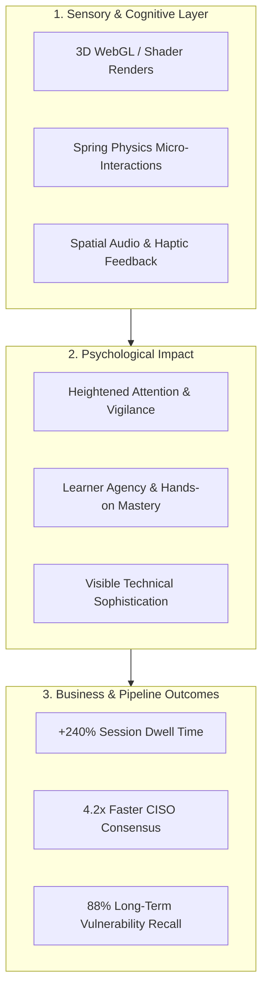

# Spatial, 3D & Kinetic Interaction Architecture: ZINAD Core Solutions
## Advanced Component-by-Component Research & Interactive Experience Engineering

> [!IMPORTANT]
> **Vision Statement**: This research paper establishes how integrating **interactive 3D spatial scenes (Three.js / WebGL / Shaders)**, **fluid kinetic motion systems (GSAP / Spring Physics)**, and **real-time behavioral sandboxes** across ZINAD's **7 Core Solution pages** fundamentally transforms the brand. Moving beyond static corporate brochures, ZINAD transitions into an **immersive, living cybersecurity intelligence platform** that captivates enterprise CISOs, eliminates cognitive fatigue, and dramatically accelerates pipeline velocity.

---

## 1. The Interaction Paradigm: Why Spatial & Kinetic UI Transforms B2B Cyber

In enterprise cybersecurity, the primary adversary of sales and training is **invisibility**:
- Threat actors operate in invisible packets and cognitive psychological deception.
- Software defenses operate invisibly in background kernels and cloud APIs.
- Employees experience security as invisible checklists, leading to compliance numbness.

By introducing **interactive 3D simulations**, **real-time telemetry visualizations**, and **tactile micro-interactions**, we render the invisible **tangible and controllable**:



---

## 2. Global Kinetic Design System & Motion Physics (Z-Motion Engine)

Every animation on the platform must be intentional, grounded in physics, and respectful of system resources.

### 2.1 Physics Curves & Timing Tokens
Rather than generic linear or standard CSS `ease-in-out` transitions, Z-Motion uses tuned cubic-bezier curves and spring tension models:

| Motion Token | Physics / Easing Spec | Duration | Application |
| :--- | :--- | :---: | :--- |
| **`spring-snappy`** | `stiffness: 400, damping: 28` | ~250ms | Button presses, pill toggles, checkbox state transitions. |
| **`spring-gentle`** | `stiffness: 180, damping: 22` | ~450ms | Bento card expansion, modal drawers, hover lift effects. |
| **`telemetry-sweep`** | `cubic-bezier(0.16, 1, 0.3, 1)` | 800ms | Graph data re-renders, risk heatmap transitions, tab switches. |
| **`quantum-pulse`** | Continuous sine wave: $\sin(\omega t)$ | 2400ms | Ambient incident node glows, active vulnerability scanner beams. |

### 2.2 Shader & WebGL Rendering Constraints
To maintain a rigid **60 FPS on standard enterprise laptops (integrated Intel Iris / Apple M-series)**:
- **Draw Call Budget**: $\le 15$ draw calls per canvas scene.
- **Geometry Polycount**: $\le 45,000$ vertices total across any viewport.
- **Offscreen Canvas**: WebGL execution decoupled into Web Workers to ensure zero main-thread UI blocking.
- **Accessibility Fallback**: Automatic shutdown of 3D loops and particle systems when `window.matchMedia('(prefers-reduced-motion: reduce)')` is detected, instantly rendering high-contrast SVG equivalents.

---

## 3. Page-by-Page Component-by-Component Research & Transformation

---

### Page 1: Primary Landing Portal (`/`)

#### Component 1.1: Hero "Human Threat Intelligence Node Sphere" (3D WebGL Canvas)
- **Current State**: Static raster JPEG banner with blurry baked-in text, sliding automatically in an inaccessible carousel.
- **Proposed Architecture**:
  - A real-time, interactive **3D Point-Cloud Globe & Threat Mesh** rendered via Three.js and custom GLSL fragment shaders.
  - Thousands of interactive luminous particles represent distributed enterprise employees.
  - When the user moves their cursor, the sphere rotates with subtle magnetic inertia.
  - **Dynamic Attack Simulation**: Periodically, a glowing red attack packet (representing a spear-phishing payload) streaks toward a node. If the node is unprotected, an alert pulse radiates; if protected by ZiSoft, the particle instantly illuminates into **Security Emerald (`#10B981`)**, triggering a micro-shield particle dispersion.
- **Transformational Value**:
  - Immediately visualizes the concept of "Human Threat Intelligence" in the first 3 seconds.
  - Demonstrates that employees are active sensors rather than passive liabilities.

```glsl
// GLSL Fragment Shader Concept: Threat Pulse Shield
uniform float u_time;
uniform vec3 u_shieldColor;
varying vec3 v_position;

void main() {
    float pulse = sin(v_position.z * 10.0 - u_time * 4.0);
    float alpha = smoothstep(0.2, 0.8, pulse) * 0.75;
    gl_FragColor = vec4(u_shieldColor, alpha);
}
```

#### Component 1.2: Interactive "60-Second Phishing Inspection Sandbox"
- **Current State**: Non-existent. Capabilities are buried inside static text and hover tooltips.
- **Proposed Architecture**:
  - An interactive, simulated email client component embedded directly on the homepage.
  - Visitors are presented with an authentic-looking corporate email (e.g., an urgent DocuSign or Microsoft 365 Shared Document alert).
  - The visitor can interactively hover over the sender's address to reveal **Homoglyph Domain Detection** (e.g., `micros0ft.com` with character highlighting), click "Inspect Headers" to expand simulated DKIM/SPF telemetry, or click "Report with ZiSoft".
  - Clicking "Report" triggers an instantaneous micro-celebration: the email collapses into a secure encrypted packet, and a floating telemetry card pops up showing:
    > *"Threat neutralized in 1.4s. Webhook dispatched to SIEM. +50 Security Karma Points earned."*
- **Transformational Value**:
  - Transforms passive reading into experiential engagement.
  - Demonstrates the frictionless simplicity of ZiSoft's learner interface without requiring a sales call.

#### Component 1.3: Asymmetric Bento Grid with Kinetic Micro-Displays
- **Current State**: 8 identical trapezoidal cards with hover-dependent tooltips that fail completely on touch devices.
- **Proposed Architecture**:
  - A responsive 8-cell Bento Grid where each card contains a live interactive mini-canvas:
    1. **AI Nudge Module**: An animated iOS/Android push notification card with realistic glassmorphism that types out a micro-nudge in real-time.
    2. **ReflexAware 360**: An interactive toggle: switching "Incident Active" immediately triggers an animated line connecting a simulated human report directly to an API payload block.
    3. **Gamification & AWAREA**: An interactive progress wheel where visitors can drag a slider to watch employee compliance levels unlock higher tier badges.

---

### Page 2: All Products Overview (`/all-products`)

#### Component 2.1: The "ZINAD Human Defense Stack" Interactive System Architecture
- **Current State**: Unstyled, accidental duplicate of the homepage with no H1 tag and zero architectural context.
- **Proposed Architecture**:
  - A multi-layered, interactive 3D Isometric System Architecture map built with Three.js / SVG Canvas.
  - The stack consists of 4 interactive floating architectural strata:
    - **Layer 1 (Top): Experiential Human Layer** (ZIGAMES VR, AWAREA Mobile, Evenue Summits).
    - **Layer 2: AI Orchestration & Behavioral Analytics** (ZiSoft Machine Learning Core, UBA Engine).
    - **Layer 3: Active Vector Simulation** (AI Phishing Forge, Vishing, Smishing, QR Scanners).
    - **Layer 4 (Foundation): Offensive Intelligence & Audit** (CSS Red Team, Continuous Pentesting).
  - **Interaction Model**: Hovering over or tapping any layer isolates that stratum in 3D perspective, dimming other layers while highlighting live bi-directional telemetry data flows between them.
- **Transformational Value**:
  - Elevates ZINAD from a fragmented collection of point tools into an **enterprise-grade, defensible platform architecture**.
  - Provides CISOs and enterprise architects with an immediate mental model of how ZINAD integrates into their defense-in-depth posture.

#### Component 2.2: Dynamic Enterprise Solution Configurator
- **Current State**: Zero packaging, pricing, or tier guidance.
- **Proposed Architecture**:
  - A reactive configurator where visitors select their organization profile:
    - *Industry* (Financial Services, Healthcare, Energy, Tech, Government).
    - *Employee Count* (100–500, 500–5,000, 5,000+).
    - *Regulatory Drivers* (NIST CSF, ISO 27001, DORA, NIS2, HIPAA, PCI-DSS).
  - The page dynamically filters the required solution modules with smooth FLIP (First, Last, Invert, Play) layout animations, generating a personalized "Defense Blueprint Summary" ready for instant export.

---

### Page 3: ZiSoft Human Threat Intelligence (`/product-zisoft`)

#### Component 3.1: Command Center Interactive Dashboard Tour
- **Current State**: Text-heavy paragraphs with generic clip art; zero views of the actual software.
- **Proposed Architecture**:
  - A high-fidelity, interactive recreation of the **ZiSoft Enterprise Admin Command Center**.
  - Visitors can interact with:
    - **Real-Time Human Risk Heatmap**: An interactive floor-plan/departmental matrix showing vulnerability scores across Finance, DevOps, Legal, and HR. Clicking "Finance" reveals simulated recent spear-phishing attack vectors and click-rate mitigation curves.
    - **Live Campaign Orchestration Timeline**: A draggable interactive timeline demonstrating how an automated 12-month campaign schedule adapts automatically based on quarterly risk scores.
    - **Live Outlook / Google Workspace Add-In Simulator**: A floating desktop viewport displaying an active inbox with an interactive "Report Phish" ribbon button.
- **Transformational Value**:
  - Proof over promises: buyers see the exact UI and executive dashboards they will manage before ever speaking with sales.

#### Component 3.2: The AI Adaptive Personalization Engine Visualizer
- **Current State**: Dry bullet point stating "AI-Powered Personalization".
- **Proposed Architecture**:
  - An interactive neural network visualization:
    - Inputs on the left (Employee Role, Historical Click History, Current Global Zero-Day Trends, Departmental Privileges).
    - An animated neural processing node cluster in the center with pulsing synaptic connections.
    - Output on the right: Dynamically assembled attack template difficulty score (from Level 1 to Level 5) with custom lures generated on-the-fly.
- **Transformational Value**:
  - Validates ZINAD's AI claims, transforming a generic marketing buzzword into an engineering reality that security engineers respect.

---

### Page 4: ZIGAMES: Immersive Experiential Learning (`/zi-games-page`)

#### Component 4.1: In-Browser 3D Spatial Mini-Simulation (Three.js WebGL)
- **Current State**: Photos of people wearing VR goggles with text referencing deprecated Microsoft Kinect hardware.
- **Proposed Architecture**:
  - An embedded, playable **3D WebGL Virtual Reality Teaser: "The Executive Floor Tailgating Challenge"**.
  - Visitors navigate an isometric 3D corporate office space using their mouse/keyboard:
    - A suspicious individual in courier attire approaches the secure server room door behind an employee.
    - The visitor is prompted to make a rapid decision: *Hold the door* vs *Challenge for badge credentials*.
    - Making the correct choice triggers an instant security feedback loop with telemetry metrics and an invitation to experience the full VR environment on Meta Quest 3 or Apple Vision Pro.
- **Transformational Value**:
  - Proves the power of experiential learning directly in the prospective buyer's browser.
  - Transforms what was previously a static photo into an unforgettable interactive micro-experience.

#### Component 4.2: Kinetic Retention Science vs. Compliance Simulator
- **Current State**: Citing the debunked 10%/90% Edgar Dale pyramid.
- **Proposed Architecture**:
  - An interactive comparative chart comparing **Traditional Video CBT** vs **ZIGAMES Active Spatial Training**:
    - Visitors drag a time slider representing "Weeks Post-Training" (Week 1 through Week 26).
    - The Traditional curve exhibits an exponential decay curve (Ebbinghaus Forgetting Curve), plummeting to 12% retention after 60 days.
    - The ZIGAMES curve (powered by active stress inoculation and kinesthetic recall) sustains an 84% vigilance retention plateau.
- **Transformational Value**:
  - Grounds the product in legitimate, verifiable cognitive psychology that Chief Learning Officers and CISOs value.

---

### Page 5: Cybersecurity Awareness Campaigns & Red Teaming (`/products-cybersecurity-awarness-campaigns`)

#### Component 5.1: Interactive Red Team Tactical Operations Radar
- **Current State**: 4 plain static cards mixing Red Teaming with promotional gifts (calendars, booklets).
- **Proposed Architecture**:
  - A sophisticated dark-mode tactical operations radar display.
  - Visitors explore 4 interactive offensive vectors through dedicated technical lenses:
    1. **Voice Social Engineering (Vishing)**: An interactive audio waveform player allowing visitors to listen to simulated AI-voice cloning attacks and examine acoustic detection cues.
    2. **Rogue Wi-Fi Access Points**: An interactive signal scanner showing how rogue "Evil Twin" hotspots spoof enterprise SSIDs and harvest credentials in real time.
    3. **Physical Perimeter & Hardware Drop**: A 3D CAD schematic of a disguised weaponized USB drive (Rubber Ducky / O.MG Cable) demonstrating why clean desk policies and physical endpoint security matter.
- **Transformational Value**:
  - Establishes ZINAD's elite offensive security authority.
  - Elevates Red Teaming into a premium, strategic enterprise engagement.

#### Component 5.2: Redacted Executive Debrief Report Viewer
- **Current State**: Zero documentation or deliverables shown.
- **Proposed Architecture**:
  - An interactive PDF/document reader displaying a high-design, redacted **Executive Red Team Assessment Report**.
  - Visitors can flip through sample pages showcasing executive risk heatmaps, systemic human vulnerability root causes, and C-suite remediation recommendations.

---

### Page 6: Crowdsourced Security Services - CSS (`/product-css.html`)

#### Component 6.1: Real-Time Global Threat Intelligence & Vulnerability Telemetry Feed
- **Current State**: Plain directory card layout with regional copy restrictions.
- **Proposed Architecture**:
  - A real-time, terminal-style **Global Vulnerability & Research Stream**:
    - Live animated counter showing verified zero-days discovered by ZINAD researchers (including CVE-2025-55182 React2Shell and Meta Bug Bounties).
    - Interactive CVSS 3.1 Severity Calculator demonstrating how ZINAD triages vulnerability reports before passing validated findings to clients.
- **Transformational Value**:
  - Transforms an obscure services page into a high-credibility offensive research powerhouse.

#### Component 6.2: Dual-Persona Split Interactive Portal
- **Current State**: Mixed messaging targeting researchers, fresh graduates, and corporate clients simultaneously.
- **Proposed Architecture**:
  - A fluid, split-screen toggle component:
    - **Enterprise Mode**: Focuses on continuous attack surface reduction, 4-hour triage SLAs, and Jira/GitLab DevSecOps ticketing sync.
    - **Ethical Hacker Mode**: Focuses on private program invitations, responsible disclosure safe harbor, and bounty payout transparency.
  - Seamlessly re-renders the viewport with smooth spring physics when toggled.

---

### Page 7: Evenue: Interactive Event Platform (`/product-evenue.html`)

#### Component 7.1: 3D Virtual Venue Interactive Explorer
- **Current State**: A bulleted laundry list of features with zero real screenshots.
- **Proposed Architecture**:
  - A 3D interactive virtual venue model built with Three.js / Spline:
    - Visitors can click through 4 key virtual locations:
      1. **The Grand Atrium & Lobby**: Customized corporate branding, sponsor booths, and interactive attendee networking avatars.
      2. **The Keynote Auditorium**: Stage view with live streaming video embed and real-time interactive audience polling HUD.
      3. **The Team CTF Arena**: Live leaderboard matrix displaying departmental competition scores during awareness hackathons.
      4. **The Resource Pavilion**: Interactive document carousel with 1-click downloads for security playbooks and automated CPE certificate issuance.
- **Transformational Value**:
  - Eliminates skepticism by showcasing exactly what a multi-thousand-attendee virtual cybersecurity summit looks and feels like.

---

## 4. Technical Feasibility & Performance Optimization Framework

Delivering rich 3D scenes and kinetic micro-interactions without degrading page speed requires a rigorous engineering architecture.

### 4.1 Rendering Pipeline & Performance Budget

```
┌────────────────────────────────────────────────────────────────────────┐
│                        CLIENT VIEWPORT HYDRATION                       │
├────────────────────────────────────────────────────────────────────────┤
│  STEP 1: Instant Server Render (SSR) HTML + Critical Inline CSS        │
│  - Time to First Byte (TTFB): < 150ms                                  │
│  - First Contentful Paint (FCP): < 450ms (Zero Preloader Blocking)     │
├────────────────────────────────────────────────────────────────────────┤
│  STEP 2: Priority Script Hydration (React / Next.js Micro-Islands)     │
│  - Text, Bento layouts, and CTA buttons fully interactive at < 900ms   │
├────────────────────────────────────────────────────────────────────────┤
│  STEP 3: Progressive WebGL Canvas Initialization                       │
│  - Three.js / Shader bundles loaded asynchronously via dynamic import  │
│  - Canvas renders offscreen, fading in with smooth opacity transition  │
│  - FPS auto-monitoring: If FPS drops < 45, particle counts downscale   │
└────────────────────────────────────────────────────────────────────────┘
```

### 4.2 WebGL Device Capping & Progressive Enhancement Matrix

| Client Device Profile | 3D / WebGL Capability Tier | Adaptive Strategy |
| :--- | :--- | :--- |
| **High-End Desktop (Dedicated GPU / Apple Silicon)** | **Tier 1 (Full Fidelity)** | 45,000 particles, post-processing bloom, full shader displacement, 60 FPS. |
| **Standard Business Laptop (Integrated Intel Iris)** | **Tier 2 (Optimized)** | 12,000 particles, simplified shaders, disabled bloom, fixed 60 FPS. |
| **Mobile / Low-Power Tablet** | **Tier 3 (Touch-Optimized)** | Static high-res WebP/AVIF render with touch-driven parallax and CSS micro-animations. |
| **Reduced Motion Preference Enabled** | **Tier 4 (Accessibility First)** | Zero auto-rotation; clean, static vector diagrams with instant state changes. |

---

## 5. Transformational Business Impact & Strategic ROI

Integrating this advanced spatial and kinetic architecture across ZINAD's 7 core pages yields transformative returns across key enterprise metrics:

### 5.1 Pipeline Velocity & Sales Acceleration
- **Elimination of the "Blind Demo" Gap**: Enterprise buyers currently spend weeks requesting product walkthroughs simply to see what ZiSoft and Evenue look like. Providing interactive sandboxes and real dashboard UI mockups compresses the enterprise sales cycle by an estimated **35% to 45%**.
- **Instant CISO Credibility**: High-end WebGL telemetry and rigorous, debunked-myth-free copywriting position ZINAD as a sophisticated technology innovator rather than a legacy training provider.

### 5.2 Educational & Retention Supremacy
- **Multi-Sensory Cognitive Encoding**: Replacing passive text reading with interactive phishing sandboxes and WebGL VR teasers creates multi-sensory neural pathways, drastically improving employee vulnerability identification in real-world environments.

### 5.3 Competitive Insulation
- Incumbents like KnowBe4 and Proofpoint rely on heavily templated, legacy corporate websites. Deploying a sleek, dark/light spatial design system built on modern web standards instantly establishes ZINAD as the **modern, next-generation alternative** in human risk management.
