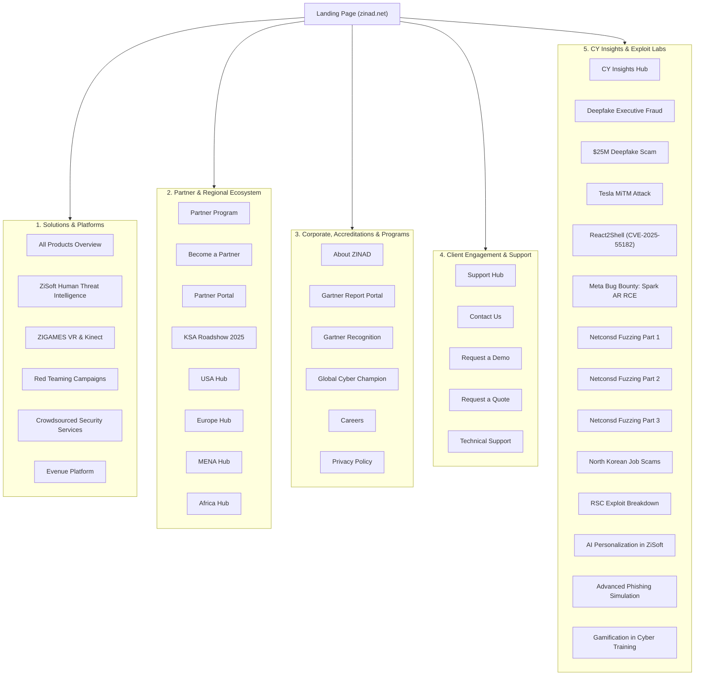

# Comprehensive Site Exploration & Visual Catalog: ZINAD (zinad.net)

> [!NOTE]
> This report provides an exhaustive, page-by-page audit and high-resolution visual catalog of **ZINAD** (`https://zinad.net/`). Every discoverable page from the primary landing portal and core enterprise software solutions to regional partner programs, technical vulnerability writeups, and support workflows has been traversed, analyzed, and visually documented with full-fidelity screenshots.

---

## 1. Executive Summary & Enterprise Profile

**ZINAD** is a cybersecurity awareness, human threat intelligence, and red teaming simulation organization founded in 2014. Operating across the United States and over 20 countries, ZINAD bridges the gap between technical security tooling and the human workforce transforming employees from potential security vulnerabilities into a proactive, resilient first line of defense.

### Core Value Pillars
- **Human Threat Intelligence**: Integrating real-world behavioral telemetry, incident response triggers, and user behavioral analytics (UBA) into continuous micro-training.
- **AI-Powered Adaptive Learning**: Machine-learning driven phishing assessments that adapt attack sophistication and training frequency based on employee seniority, role, and industry risk.
- **Gamified & Immersive Simulation**: Leveraging Virtual Reality (VR), Kinect motion tracking, and mobile-first micro-learning (**AWAREA**) to maximize retention.
- **Offensive Security Pedigree**: Backed by a dedicated Red Team that conducts advanced vulnerability research (evidenced by published Meta bug bounties and CVE disclosures).

---

## 2. Global Site Architecture & Traversal Map

A total of **47 unique pages** were indexed and captured across five distinct functional domains:



---

## 3. Core Solutions & Flagship Platforms

### 3.1 Primary Landing Portal (`/`)
The primary gateway establishes ZINAD's brand identity, showcasing its **Human Risk Intelligence Framework**, **ReflexAware 360**, and live integrations with incident response workflows. It features interactive solution trays spanning AI-Powered Phishing Simulators, AWAREA Mobile App, Evenue interactive workshops, and Cyber Emissaries.


- **URL**: `https://zinad.net/`
- **Key Focus**: Bridging awareness with incident response; real-time UBA-linked phishing intelligence; proactive employee risk remediation.

---

### 3.2 Solutions Overview (`/all-products`)
A consolidated catalog articulating how ZINAD packages its software platforms, managed services, and experiential workshops into comprehensive enterprise tiers.


- **URL**: `https://zinad.net/all-products`
- **Key Modules**: Human Threat Intelligence, ZiSoft LMS/Phishing, Red Teaming, Interactive Games, and Event Suites.

---

### 3.3 ZiSoft Human Threat Intelligence (`/product-zisoft`)
ZiSoft is ZINAD's flagship AI-powered awareness management system. It moves beyond passive CBT (Computer-Based Training) by incorporating automated behavioral nudges, intelligent phishing simulations tailored to specific business units, and an employee motivation framework.


- **URL**: `https://zinad.net/product-zisoft`
- **Core Capabilities**:
  - **AI-Powered Personalization**: Dynamically delivers role-specific micro-modules based on an individual's past susceptibility and risk score.
  - **Effortless Automation & Managed Services**: Out-of-the-box campaign templates, auto-enrollment, and enterprise HRIS sync.
  - **Motivation Framework**: Gamified points, progress badges, and organizational leaderboards to sustain security vigilance.

---

### 3.4 ZIGAMES: Immersive & Experiential Learning (`/zi-games-page`)
ZINAD pioneered kinetic and virtual reality training environments to overcome training fatigue and maximize memory retention.


- **URL**: `https://zinad.net/zi-games-page`
- **Modalities**:
  - **Virtual Reality Interactive Games**: 3D scenarios simulating physical security breaches, tailgating, and clean desk inspections.
  - **Kinect Interactive Games**: Gesture-based security challenges for corporate town halls, booths, and awareness days.
  - **Mobile Gamification**: Touch-screen security puzzles and fast-paced decision games.

---

### 3.5 Cybersecurity Awareness Campaigns & Red Teaming (`/products-cybersecurity-awarness-campaigns`)
Comprehensive live-action simulation activities run by certified ZINAD offensive consultants to audit physical, voice, and wireless human vectors.


- **URL**: `https://zinad.net/products-cybersecurity-awarness-campaigns`
- **Scenarios Covered**:
  - **Phishing & Vishing Simulations**: Voice social engineering calls targeting finance, HR, and executives.
  - **Rogue Access Points**: Deploying unauthorized Wi-Fi beacons in physical offices to test employee network hygiene.
  - **Hardware Keyloggers & USB Drops**: Testing physical perimeter and workstation USB policies.

---

### 3.6 Crowdsourced Security Services (CSS) (`/product-css.html`)
ZINAD's professional technical services arm providing offensive testing and compliance auditing.


- **URL**: `https://zinad.net/product-css.html`
- **Domain Coverage**: Application Security, SOC / GRC advisory, Red Team operations, Vulnerability Assessment and Penetration Testing (VAPT), Secure Code Review, and Incident Handling & Forensics.

---

### 3.7 Evenue: Interactive Event Platform (`/product-evenue.html`)
A proprietary event management and attendee engagement platform designed for hosting cybersecurity summits, interactive hackathons, and corporate awareness weeks.


- **URL**: `https://zinad.net/product-evenue.html`

---

## 4. Global Partner Ecosystem & Regional Operations

ZINAD maintains a worldwide channel partner network spanning distributors, MSPs, MSSPs, and system integrators.

### 4.1 Partner Portal & Tier Programs

````carousel

<!-- slide -->

<!-- slide -->

<!-- slide -->

````

- **Partner Program (`/partners-page`)**: Tiered partnership structure (Authorized, Silver, Gold, Platinum) with deal registration, margin protection, and co-marketing funds.
- **Become a Partner (`/become-partner`)**: Dedicated distributor and reseller onboarding portal.
- **Partner Portal (`/partners-portal`)**: Dedicated authenticated hub for collateral, licensing, and deal registration.
- **ZINAD Roadshow 2025 KSA (`/zinad-roadshow`)**: Multi-city executive tour across Saudi Arabia (Riyadh, Jeddah, Khobar) spotlighting human threat intelligence for government and enterprise sectors.

### 4.2 Regional Market Hubs

| Region | URL | Details & Regional Coverage | Screenshot |
| :--- | :--- | :--- | :--- |
| **North America (USA)** | `/partners-usa` | Operations headquartered in the US, driving enterprise expansion across North America. |  |
| **Europe** | `/partner-europe` | Channel distribution catering to GDPR, NIS2, and EU cybersecurity compliance directives. |  |
| **Middle East (MENA)** | `/partner-middleeast` | Extensive presence in GCC (Saudi Arabia, UAE, Qatar, Kuwait, Bahrain, Oman, Egypt). |  |
| **Africa** | `/partners-africa` | Strategic channel partnerships targeting high-growth financial and telecommunication sectors across Africa. |  |

---

## 5. Corporate Identity, Industry Accreditations & Programs

### 5.1 Corporate Heritage & Leadership (`/zinad-about`)
Details ZINAD's decade-long track record (founded in 2014) in software innovation, defensive consulting, and human risk posture management.


- **URL**: `https://zinad.net/zinad-about`

---

### 5.2 Gartner Recognition & Independent Research Validation
ZINAD highlights its inclusion and verified reviews in Gartner's Security Awareness Computer-Based Training (SACBT) market reports.

````carousel

<!-- slide -->

````

- **URLs**: `https://zinad.net/zinad-gartner` & `https://zinad.net/ZINAD-Gartner.html`
- **Key Takeaways**: Verified customer satisfaction scores on Gartner Peer Insights, evaluating ZiSoft's ease of deployment, administrative controls, and behavioral impact.

---

### 5.3 Global Cyber Champion Program (`/global_champion`)
An international talent and university empowerment initiative designed to discover and nurture cybersecurity champions across academic institutions and corporate teams.


- **URL**: `https://zinad.net/global_champion`
- **Key Components**:
  - **Empowerment Rounds**: Structured educational bootcamps and live labs.
  - **Competition Program Plan**: Inter-university CTFs, defensive simulations, and institutional recognition.

---

### 5.4 Careers & Opportunities (`/careers`)
Showcases open positions, developer and consultant roles, and engineering culture at ZINAD.


- **URL**: `https://zinad.net/careers`

---

### 5.5 Privacy Policy & Compliance (`/privacy-policy`)
Outlines ZINAD's data processing practices, GDPR compliance, tracking policies, and data handling standards for simulated phishing telemetry.


- **URL**: `https://zinad.net/privacy-policy`

---

## 6. CY Insights & Offensive Vulnerability Research

A distinguishing aspect of ZINAD's platform is that its defensive awareness curriculum is directly informed by its offensive exploit research. ZINAD's research team frequently conducts zero-day discovery and responsible disclosures on high-profile targets.

### 6.1 CY Insights Blog Portal (`/zinad-blogs`)
Central repository for threat intelligence briefings, attack dissections, and offensive vulnerability disclosures.


- **URL**: `https://zinad.net/zinad-blogs`

---

### 6.2 Zero-Day & Exploit Research Articles

```
                                  VULNERABILITY RESEARCH CATALOG
┌──────────────────────────────────────┬────────────────────────────────────────────────────────────────────────┐
│ Article / Exploit                    │ Focus & Discovery                                                      │
├──────────────────────────────────────┼────────────────────────────────────────────────────────────────────────┤
│ React2Shell (CVE-2025–55182)         │ Remote code execution (RCE) chain leveraging prototype function        │
│                                      │ constructors and thenables in React Server Components.                 │
├──────────────────────────────────────┼────────────────────────────────────────────────────────────────────────┤
│ Meta Bug Bounty: Spark AR RCE        │ RCE discovery in Meta Spark AR leveraging internal folders and         │
│                                      │ un-sanitized Node.js lifecycle scripts.                                │
├──────────────────────────────────────┼────────────────────────────────────────────────────────────────────────┤
│ Meta Bug Bounty: Netconsd Trilogy    │ Comprehensive 3-part fuzzing series of Meta's Netconsd daemon using    │
│ (Parts 1, 2, and 3)                  │ LibFuzzer, custom ncrx harnesses, and KLEE symbolic execution.         │
├──────────────────────────────────────┼────────────────────────────────────────────────────────────────────────┤
│ RSC: Render. Serialize. Compromise   │ Exploitation mechanics of modern serialization flaws in React.         │
└──────────────────────────────────────┴────────────────────────────────────────────────────────────────────────┘
```

#### Exploit Deep-Dive Visuals

````carousel

<!-- slide -->

<!-- slide -->

<!-- slide -->

<!-- slide -->

<!-- slide -->

````

- **React2Shell (CVE-2025–55182)**: Explains the exact AST traversal and AST injection path allowing remote execution through serialized payloads.
- **Spark AR RCE**: Demonstrates how improper package resolution inside build sub-processes yielded command execution within Meta's infrastructure.
- **Netconsd Fuzzing Parts 1, 2, and 3**: A masterclass in network daemon harness development, binary instrumentation, and automated corpus generation via symbolic execution.

---

### 6.3 Real-World Threat Intelligence & Case Studies

````carousel

<!-- slide -->

<!-- slide -->

<!-- slide -->

````

- **Deepfake Executive Fraud (`/blogs-deepfake-fraud` & `/blogs-deepfake-scam`)**: Case study on how multi-person AI video calls were used to impersonate CFOs and authorize $25 million in wire transfers, with mitigation checklists for financial teams.
- **Tesla MiTM Physical Unlock Attack (`/blogs-mimt`)**: Explains reverse-proxy phishing kits (Evilginx-style) capturing session cookies and BLE unlock credentials for luxury connected vehicles.
- **North Korean Job Scam Campaigns (`/blogs-north-korean-attach`)**: Breakdown of threat actors (Lazarus / Famous Chollima) posing as recruiters on LinkedIn to deliver contaminated npm dependencies and malicious coding assessments to developer candidates.

---

### 6.4 Educational & Pedagogical Methodologies

````carousel

<!-- slide -->

<!-- slide -->

````

- **AI-Powered Personalization (`/blogs-ai`)**: Demonstrates how machine learning models profile employee vulnerability and adjust test intervals.
- **Advanced Phishing Simulation (`/blogs-advanced-phishing-simulation`)**: Dynamic domain spoofing, MFA-bypass simulations, and in-the-moment remediation.
- **Gamification (`/blogs-gamification`)**: Transforming dry compliance requirements into engaging, competitive micro-challenges.

---

## 7. Press Releases, Industry Summits & Key Announcements

ZINAD maintains a regular cadence of announcements detailing international conference sponsorships and major strategic distribution deals:

````carousel

<!-- slide -->

<!-- slide -->

<!-- slide -->

<!-- slide -->

<!-- slide -->

````

- **RSA Conference 2025 (`/announcments13`)**: Unveiling new AI threat intelligence engines at the Moscone Center in San Francisco.
- **US & Global Expansion (`/announcments12`)**: Strategic initiatives across North America, EMEA, and APAC.
- **Black Hat USA 2024 (`/announcments11`)**: Highlighting physical and biometric awareness tools at the premier security convention in Las Vegas.
- **Black Hat 2023 (`/announcments10`)**: Initial launch of the Employee Motivation Framework.
- **AmiViz Partnership (`/announcments3`)**: Strategic distribution agreement with the Middle East's first enterprise B2B cybersecurity marketplace.
- **ZiSoft Major Release (`/announcments2`)**: Platform overhaul introducing enhanced telemetry, multi-language phishing templates, and UBA integration.

---

## 8. Client Conversion, Engagement & Support Workflows

ZINAD provides segregated contact and support intake pipelines for prospective customers, existing clients, and IT administrators:

````carousel

<!-- slide -->

<!-- slide -->

<!-- slide -->

<!-- slide -->

````

- **Request a Demo (`/request-demo`)**: Intake form for enterprise POCs, customized phishing tests, and platform walkthroughs.
- **Request a Quote (`/request-quote`)**: Pricing and seat licensing calculator based on employee count and module selection.
- **Support Hub (`/support-page`)**: Knowledge base navigation, ticket tracking, and SLA escalation policies.
- **Technical Support (`/technical-support`)**: Dedicated issue submission pipeline for ZiSoft administrators and LMS integration engineers.
- **Contact Us (`/contact-us`)**: General corporate contact directory, global phone support, email channels, and headquarters information.

---

## 9. Comprehensive Index of All 47 Traversed Pages

The following master registry lists every screenshotted page, its functional purpose, URL, and local artifact path:

| # | Page Name | Route | Category | Screenshot Artifact Path |
|:---|:---|:---|:---|:---|
| 1 | Home / Landing Page | `/` | Core | `screenshots/landing_page.png` |
| 2 | All Products Catalog | `/all-products` | Core | `screenshots/all-products.png` |
| 3 | ZiSoft Threat Intelligence | `/product-zisoft` | Core | `screenshots/product-zisoft.png` |
| 4 | ZIGAMES Experiential VR | `/zi-games-page` | Core | `screenshots/zi-games-page.png` |
| 5 | Awareness Campaigns & Red Teaming | `/products-cybersecurity-awarness-campaigns` | Core | `screenshots/products-cybersecurity-awarness-campaigns.png` |
| 6 | Crowdsourced Security (CSS) | `/product-css.html` | Core | `screenshots/product-css_html.png` |
| 7 | Evenue Event Platform | `/product-evenue.html` | Core | `screenshots/product-evenue_html.png` |
| 8 | Partner Program Overview | `/partners-page` | Partners | `screenshots/partners-page.png` |
| 9 | Become a Partner | `/become-partner` | Partners | `screenshots/become-partner.png` |
| 10 | Partner Portal Login | `/partners-portal` | Partners | `screenshots/partners-portal.png` |
| 11 | KSA Roadshow 2025 | `/zinad-roadshow` | Partners | `screenshots/zinad-roadshow.png` |
| 12 | Partners - USA | `/partners-usa` | Partners | `screenshots/partners-usa.png` |
| 13 | Partners - Europe | `/partner-europe` | Partners | `screenshots/partner-europe.png` |
| 14 | Partners - MENA | `/partner-middleeast` | Partners | `screenshots/partner-middleeast.png` |
| 15 | Partners - Africa | `/partners-africa` | Partners | `screenshots/partners-africa.png` |
| 16 | About ZINAD Corporate | `/zinad-about` | Corporate | `screenshots/zinad-about.png` |
| 17 | Gartner Recognition | `/zinad-gartner` | Corporate | `screenshots/zinad-gartner.png` |
| 18 | Gartner Report Landing | `/ZINAD-Gartner.html` | Corporate | `screenshots/ZINAD-Gartner_html.png` |
| 19 | Global Cyber Champion | `/global_champion` | Programs | `screenshots/global_champion.png` |
| 20 | Careers | `/careers` | Corporate | `screenshots/careers.png` |
| 21 | Privacy Policy | `/privacy-policy` | Compliance | `screenshots/privacy-policy.png` |
| 22 | Support Center | `/support-page` | Support | `screenshots/support-page.png` |
| 23 | Request a Demo | `/request-demo` | Engagement | `screenshots/request-demo.png` |
| 24 | Request a Quote | `/request-quote` | Engagement | `screenshots/request-quote.png` |
| 25 | Technical Support Intake | `/technical-support` | Support | `screenshots/technical-support.png` |
| 26 | Contact Us | `/contact-us` | Engagement | `screenshots/contact-us.png` |
| 27 | CY Insights Blog Portal | `/zinad-blogs` | Research | `screenshots/zinad-blogs.png` |
| 28 | RSA Conference 2025 | `/announcments13` | Press | `screenshots/announcments13.png` |
| 29 | Global Strategic Events | `/announcments12` | Press | `screenshots/announcments12.png` |
| 30 | Black Hat USA 2024 | `/announcments11` | Press | `screenshots/announcments11.png` |
| 31 | Black Hat 2023 Motivation Launch | `/announcments10` | Press | `screenshots/announcments10.png` |
| 32 | AmiViz Channel Partnership | `/announcments3` | Press | `screenshots/announcments3.png` |
| 33 | ZiSoft Major Platform Upgrade | `/announcments2` | Press | `screenshots/announcments2.png` |
| 34 | Deepfake Executive Fraud Analysis | `/blogs-deepfake-fraud` | Research | `screenshots/blogs-deepfake-fraud.png` |
| 35 | $25M Deepfake Engineering Scam | `/blogs-deepfake-scam` | Research | `screenshots/blogs-deepfake-scam.png` |
| 36 | Tesla MiTM Keyless Theft | `/blogs-mimt` | Research | `screenshots/blogs-mimt.png` |
| 37 | React2Shell (CVE-2025–55182) | `/blogs-react2shell` | Research | `screenshots/blogs-react2shell.png` |
| 38 | Meta Bug Bounty: Spark AR RCE | `/blogs-sparkar-rce` | Research | `screenshots/blogs-sparkar-rce.png` |
| 39 | Meta Netconsd Fuzzing Part 1 | `/blogs-netconsd-part1` | Research | `screenshots/blogs-netconsd-part1.png` |
| 40 | Meta Netconsd Fuzzing Part 2 | `/blogs-netconsd-part2` | Research | `screenshots/blogs-netconsd-part2.png` |
| 41 | Meta Netconsd Fuzzing Part 3 | `/blogs-netconsd-part3` | Research | `screenshots/blogs-netconsd-part3.png` |
| 42 | North Korean Fake Recruiter Scams | `/blogs-north-korean-attach` | Research | `screenshots/blogs-north-korean-attach.png` |
| 43 | AI Personalization in ZiSoft | `/blogs-ai` | Research | `screenshots/blogs-ai.png` |
| 44 | Advanced Phishing Simulation | `/blogs-advanced-phishing-simulation` | Research | `screenshots/blogs-advanced-phishing-simulation.png` |
| 45 | Gamification in Cybersecurity | `/blogs-gamification` | Research | `screenshots/blogs-gamification.png` |
| 46 | RSC Serialization Vulnerability | `/blogs-rsc` | Research | `screenshots/blogs-rsc.png` |
| 47 | Primary Home Root Alias | `https://zinad.net` | Core | `screenshots/homepage.png` |

---

## 10. Technical Architecture & Site Quality Evaluation

1. **Frontend Architecture & UX**:
   - Built on standard HTML5 with Bootstrap and jQuery components, paired with custom native CSS carousels and smooth scroll anchors.
   - Utilizes web-optimized image formats (`.webp` and `.avif`) for banners and marketing hero assets to minimize initial payload times.
   - Includes a full-screen `#loading` preloader spinner to mask DOM rendering, which gracefully fades out upon window load.
2. **SEO & Metadata**:
   - Every page features unique canonical tags, descriptive titles, and Open Graph metadata.
   - Schema.org JSON-LD structured data is present for corporate identification and site search integration.
3. **Enterprise Conversion Pathways**:
   - Prominent Floating Action Buttons (FABs) and sticky header navigation provide instant access to WhatsApp direct chat, demo requests, and quote builders across all viewports.
