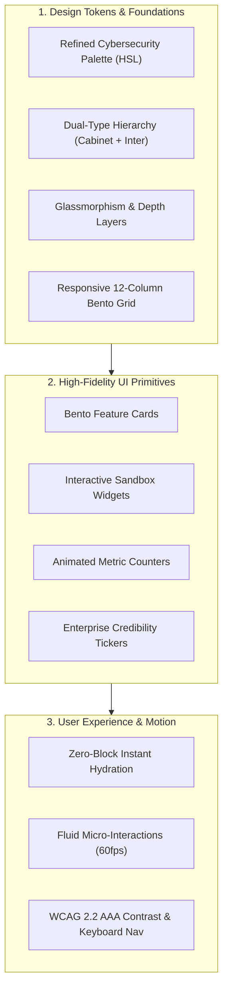
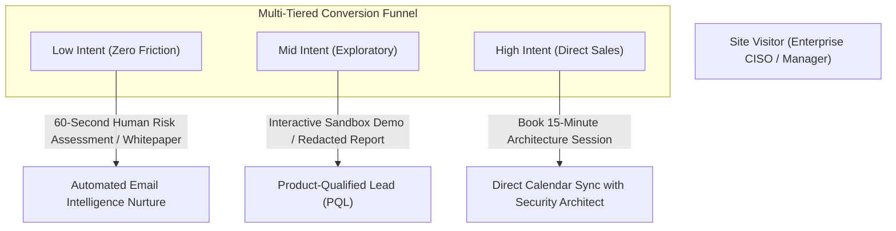

# Master Transformation Blueprint: ZINAD Core Solutions & Platforms
## Enterprise Product Design, Strategic Copywriting & Conversion Engineering Architecture

> [!IMPORTANT]
> **Executive Mandate**: This masterplan establishes an end-to-end, world-class standard to resolve every flaw identified across ZINAD's **7 Core Solutions & Platform pages**. It re-engineers ZINAD from a legacy corporate website into a Tier-1 Cybersecurity SaaS leader out-positioning incumbents like **KnowBe4**, **Hoxhunt**, **SoSafe**, and **Proofpoint** by leveraging ZINAD's unique offensive Red Teaming and immersive experiential moats.

---

## 1. Enterprise Design System & Visual Architecture (Z-Design Engine)

To eradicate the dated 2012-era trapezoidal containers, harsh gradients, and blurry raster graphics, ZINAD requires a unified, modern B2B SaaS Design System.



### 1.1 Curated Color Palette & Visual Tokens
The current harsh primary red (`#c00000` / `#912124`) on blinding white creates visual fatigue and lacks enterprise sophistication. The new palette establishes an authoritative, security-first visual tone:

| Token Name | Hex Code | HSL Value | Strategic Usage |
| :--- | :--- | :--- | :--- |
| **Obsidian Deep** (Dark Mode Base) | `#0B0F19` | `223°, 39%, 7%` | High-contrast background for Red Teaming and technical hero sections. |
| **Cyber Crimson** (Primary Accent) | `#E11D48` | `347°, 77%, 50%` | High-visibility primary action buttons, active risk alerts, key highlights. |
| **Deep Velvet** (Secondary Dark) | `#1E293B` | `217°, 33%, 17%` | Card surfaces, modal headers, navigation bar container backgrounds. |
| **Security Emerald** (Success Metric) | `#10B981` | `160°, 84%, 39%` | Verified compliance badges, reduced-risk percentages, positive telemetry. |
| **Text Primary** | `#0F172A` / `#F8FAFC` | `222°, 47%, 11%` | Crisp, high-contrast typography in light and dark modes (minimum 7:1 ratio). |
| **Glass Border** | `rgba(255,255,255,0.08)` |   | Micro-borders for modern glassmorphic cards replacing heavy drop shadows. |

### 1.2 Dual-Type Typography Hierarchy
- **Display & Headings**: **Outfit** or **Cabinet Grotesk** (Geometric, authoritative, modern, tech-forward).
- **Body, Inputs & Microcopy**: **Inter** or **Plus Jakarta Sans** (Engineered for digital screens, open apertures, tall x-height, exceptional legibility at 14px–16px).
- **Monospace & Telemetry**: **JetBrains Mono** for incident logs, attack vectors, API webhooks, and CVE references.
- **Fluid Type Scale**:
  $$\text{Display Hero} = \text{clamp}(2.75\text{rem}, 5\text{vw}, 4.5\text{rem})$$
  $$\text{Section H2} = \text{clamp}(2.0\text{rem}, 3.5\text{vw}, 3.0\text{rem})$$
  $$\text{Body Text} = 1.125\text{rem (18px)} \text{ with line-height of } 1.65$$

### 1.3 Card & Layout Modernization: The Bento Grid
- **Retire Trapezoidal Boxes**: Eliminate custom trapezoidal CSS shapes. They break responsive layouts, waste 35% of horizontal screen space, and look dated.
- **Implement Adaptive Bento Grids**: Use modern CSS Grid containers with `auto-fit` and `minmax(320px, 1fr)`. Each card encapsulates:
  1. A category micro-pill (e.g., `AI Adaptive Engine`, `Real-Time Incident Hook`).
  2. Concise, benefit-led headline.
  3. Visible body text (eliminating hover-only tooltips).
  4. An interactive miniature visual (live graph, micro-toggle, or animated code snippet).

---

## 2. Brand Positioning & Persona Copywriting Framework

Cybersecurity buyers do not purchase "awareness"; they purchase **breach risk reduction**, **audit compliance assurance**, and **time back for SecOps teams**.

```
                           THE ZINAD VALUE EQUATION
┌──────────────────────────────────────────────────────────────────────────────┐
│  Quantified Business Outcome (Breach Risk Slash / Audit Pass)                 │
│  ─────────────────────────────────────────────────────────────  = HIGH VALUE │
│       Friction (Admin Overhead) + Disruption (Employee Fatigue)              │
└──────────────────────────────────────────────────────────────────────────────┘
```

### 2.1 Persona-Specific Messaging Matrices

#### Persona A: Chief Information Security Officer (CISO) & Board
- **Pain Points**: Board accountability for phishing breaches, cyber insurance compliance hurdles, audit exhaustion (NIST/ISO/DORA).
- **ZINAD Solution Pitch**: *"Turn human vulnerability from your greatest attack surface into an active threat intelligence telemetry network with board-ready predictive risk scoring."*
- **Proof Mechanism**: ReflexAware 360 mapped directly to NIST CSF 2.0 (PR.AT, DE.CM) and ISO 27001:2022 Annex A 5.7 & 7.2.

#### Persona B: SecOps & Incident Response (IR) Leads
- **Pain Points**: Bombarded with false-positive phishing reports; slow manual triage; employee clicks detected hours after an attack payload deploys.
- **ZINAD Solution Pitch**: *"When an employee reports a suspicious message in ZiSoft, it is instantly enriched against live threat intelligence and piped via Webhook to your SIEM/SOAR in under 2 seconds."*
- **Proof Mechanism**: Real-time webhook architecture, automated payload detonation, and continuous integration with Microsoft Sentinel, Splunk, and Palo Alto Cortex.

#### Persona C: Security Awareness & Culture Managers (HR / Training)
- **Pain Points**: Low employee completion rates, negative cultural blowback from punitive phishing tests, high manual administration time.
- **ZINAD Solution Pitch**: *"Zero-touch automated learning journeys with AI-personalized difficulty that employees actually enjoy reducing your campaign administration time by 85%."*
- **Proof Mechanism**: Gamified rewards, mobile-first AWAREA micro-learning, automated HRIS user syncing (Workday, Azure AD, Okta).

### 2.2 Editorial Standard Operating Procedure (SOP)
1. **Zero Typo Tolerance**: Automated CI/CD spell-checking on all markdown and HTML files using `cspell` with custom enterprise cybersecurity dictionaries.
2. **Elimination of Pseudo-Science**: Remove debunked learning pyramid statistics ("10% of what we read, 90% of what we do"). Replace with verified cognitive science: **Spaced Repetition**, **Interleaving**, and **Active Retrieval Practice**.
3. **Idiom & Localization Review**: Audit all marketing copy through native English enterprise copywriters to eliminate direct translation artifacts (e.g., replacing *"We Introduce Security Awareness in Its New Suit"* with *"Experiential Cybersecurity: Immersive VR & Adaptive Simulations"*).

---

## 3. Surgical Solutions for Each of the 7 Core Pages

---

### Solution 1: Primary Landing Portal (`/`)

#### The Problem
Auto-sliding banner carousel with unreadable text on mobile; zero actual product screenshots; critical capability explanations hidden inside hover tooltips; missing primary hero CTA.

#### The Architectural Solution Blueprint

```
┌─────────────────────────────────────────────────────────────────────────────────────────┐
│ [Nav: Logo]     [Solutions ▾] [Platform Architecture] [Gartner] [Resources]   [Book Demo]│
├─────────────────────────────────────────────────────────────────────────────────────────┤
│                                                                                         │
│  [Pill: ★ Gartner Peer Insights 4.8 / 5.0 | Leader in Human Risk Management]            │
│                                                                                         │
│  Stop Phishing at the Human Endpoint.                                                  │
│  Powered by Real-Time Threat Intelligence.                                              │
│                                                                                         │
│  ZiSoft combines AI-personalized attack simulations with live incident telemetry        │
│  to transform your employees into an active defense sensor network.                     │
│                                                                                         │
│  [ primary: Request Custom Demo ]    [ secondary: Try 60-Sec Phishing Simulator ❯ ]     │
│                                                                                         │
│  ┌───────────────────────────────────────────────────────────────────────────────────┐  │
│  │ LIVE INTERACTIVE UI SHOWCASE:                                                     │  │
│  │ Real-Time Risk Heatmap | Outlook Report Nudge | Automated SOC Alert Feed          │  │
│  └───────────────────────────────────────────────────────────────────────────────────┘  │
│                                                                                         │
│  [ Enterprise Trust Ticker: SOC2 Certified | ISO 27001 | GDPR Ready | Fortune 500 Logos] │
└─────────────────────────────────────────────────────────────────────────────────────────┘
```

#### Detailed Transformation Specifications
1. **Hero Section Overhaul**:
   - **Static, High-Impact Split Hero**: Eliminate the auto-rotating slider entirely. Replace with a conversion-optimized split layout:
     - Left: Authoritative headline, quantifiable sub-headline, dual CTAs (*"Book Live Demo"* and *"Interactive Simulator"*), and a compliance badge strip (Gartner, SOC 2, ISO 27001).
     - Right: High-resolution, interactive 3D browser frame showing the **ZiSoft Human Threat Intelligence Command Center** with real-time risk scores and simulated threat telemetry.
2. **Interactive Phishing Simulator Component (Above-the-Fold)**:
   - Provide an embedded, interactive email preview where visitors can click "Inspect Headers", "Check Links", or "Simulate Attack" to experience ZINAD's learner feedback loop live without filling out a form.
3. **Modular Capability Showcase (Replacing Trapezoids)**:
   - Convert the 8 modules into an asymmetric 8-tile Bento Grid.
   - Every tile features permanent, readable typography, an active metric (e.g., *"99.4% Delivery Rate"* for SMS/Email Nudges, *"12,000+ Scenarios"* for Phishing Simulator), and an illustration of the actual learner interface.
4. **Interactive ROI & Risk Reduction Calculator**:
   - An interactive slider allowing CISOs to input their employee count (e.g., 2,500 employees) to instantly calculate estimated annual savings from avoided phishing remediation and reduced Cyber Insurance premiums.

---

### Solution 2: All Products Overview (`/all-products`)

#### The Problem
Currently a broken duplicate of the homepage's middle section with no H1 tag, no intro, no distinct positioning, and no guidance on how the products interconnect.

#### The Architectural Solution Blueprint
Reposition this page as the **"ZINAD Human Risk Operating System (HROS)   Architecture & Solutions Catalog"**.

```
                               THE ZINAD DEFENSE STACK
┌────────────────────────────────────────────────────────────────────────────────────────┐
│ 1. ENGAGEMENT LAYER: ZIGAMES (VR / WebGL) + AWAREA Mobile + Evenue Interactive Events   │
├────────────────────────────────────────────────────────────────────────────────────────┤
│ 2. CORE INTELLIGENCE ENGINE: ZiSoft AI Personalization + Behavioral UBA Scoring        │
├────────────────────────────────────────────────────────────────────────────────────────┤
│ 3. ACTIVE SIMULATION LAYER: AI Phishing Forge + Smishing/Vishing + Rogue AP Audits     │
├────────────────────────────────────────────────────────────────────────────────────────┤
│ 4. OFFENSIVE RESEARCH & SERVICES: Red Teaming + CSS Crowdsourced Pentesting + Bug Bounty│
└────────────────────────────────────────────────────────────────────────────────────────┘
```

#### Detailed Transformation Specifications
1. **Add Clear Semantic Hierarchy & H1**:
   - `<h1>The ZINAD Human Defense Operating System</h1>`
   - Subtitle: *"A unified ecosystem connecting behavioral training, active red teaming, and real-time threat response."*
2. **Interactive Platform Stack Diagram**:
   - An interactive diagram illustrating how data flows between layers:
     - *Learner clicks in ZiSoft* $\rightarrow$ *Triggers behavioral score in UBA* $\rightarrow$ *Feeds adaptive scenario into ZIGAMES* $\rightarrow$ *Informs Red Team physical scoping*.
3. **Solution Comparison & Packaging Matrix**:
   - Structured comparison table with 3 clear enterprise tiers:
     - **Essentials**: ZiSoft Core LMS + Automated Phishing + Compliance reporting.
     - **Advanced Threat**: Essentials + AI Adaptive Simulator + AWAREA Mobile + ReflexAware 360 SOAR Hooks.
     - **Enterprise Defense Suite**: Advanced + ZIGAMES VR Hardware/Software + Annual Red Teaming Social Engineering + CSS Dedicated Pentesting.
   - Each tier has a dedicated *"Request Tier Scope"* CTA button.

---

### Solution 3: ZiSoft Human Threat Intelligence (`/product-zisoft`)

#### The Problem
Wall-of-text introductory paragraphs; generic clip-art illustrations; feature-dump bullet points lacking business benefits; zero screenshots of the actual admin console, learner dashboard, or email client plugins.

#### The Architectural Solution Blueprint

```
┌─────────────────────────────────────────────────────────────────────────────────────────┐
│ ZISOFT PRODUCT TOUR                                                                     │
├─────────────────────────┬───────────────────────────────────────────────────────────────┤
│ [ Adaptive AI Engine ]  │  [INTERACTIVE TAB VIEW: High-Res UI Mockup]                   │
│ [ Attack Simulation ]   │  - Dynamic Risk Heatmap showing department vulnerability      │
│ [ ReflexAware 360 ]     │  - Real-time click, report, and ignore metrics                │
│ [ Native Email Add-in ] │  - Automated AI difficulty adjustment timeline                │
│ [ Board Reporting ]     │                                                               │
└─────────────────────────┴───────────────────────────────────────────────────────────────┘
```

#### Detailed Transformation Specifications
1. **Interactive Feature Tour (Tabbed Interface)**:
   - Replace the 16 repetitive text blocks with a 5-tab dynamic showcase:
     - **Tab 1: AI-Powered Behavioral Personalization**: Visualizing the algorithm that profiles employee roles (Finance vs Engineering) and customizes attack difficulty.
     - **Tab 2: The Attack Simulation Forge**: Highlighting 2,000+ templates, dynamic QR code phishing (Quishing), and OAuth consent grant simulation.
     - **Tab 3: ReflexAware 360 & Incident Response Hooks**: Visualizing the bi-directional API connecting employee inbox reporting directly to SIEM/SOAR platforms.
     - **Tab 4: Native Inbox Integration**: High-DPI mockups of the 1-click "Report Suspicious Email" button inside Microsoft 365, Google Workspace, and mobile clients.
     - **Tab 5: Executive Risk Intelligence & Compliance**: Sample board-ready PDF reports demonstrating adherence to NIST, ISO 27001, and SOC 2 frameworks.
2. **Benefit-Driven Copy Revision**:
   - *Current*: `"Automated Campaigns & Reminders"`
   - *Upgraded*: `"Zero-Touch Campaign Orchestration: Set Once, Automate Year-Round Security Compliance."`
   - *Current*: `"Actionable Insights & Analytics"`
   - *Upgraded*: `"Board-Ready Risk Metrics: Translate Click Rates into Measurable Financial Risk Reduction."`
3. **Interactive Integration Gallery**:
   - Visual grid of native integration logos: Microsoft Azure AD, Okta, Splunk, Microsoft Sentinel, Slack, Teams, Workday, Google Workspace.

---

### Solution 4: ZIGAMES: Immersive Experiential Learning (`/zi-games-page`)

#### The Problem
Promoting obsolete hardware (Microsoft Kinect); citing debunked pseudo-scientific retention stats; awkward phrasing (*"In Its New Suit"*); zero video previews or gameplay demonstrations.

#### The Architectural Solution Blueprint

```
┌─────────────────────────────────────────────────────────────────────────────────────────┐
│ ZIGAMES: Experiential Cybersecurity Training                                            │
│ [Headline: Move Beyond Passive Videos. Build Security Muscle Memory Through Action.]    │
├─────────────────────────────────────────────────────────────────────────────────────────┤
│  [ 3D WebGL In-Browser Game Preview: "The Clean Desk & Tailgating Challenge" ]          │
│  [ Click to Play 30-Second Micro-Simulation ]                                           │
├─────────────────────────┬───────────────────────────────┬───────────────────────────────┤
│ Spatial & VR Security   │ Browser-Based Gamification    │ Cyber Escape Rooms            │
│ Meta Quest 3 & VisionPro│ WebGL & Mobile-First AWAREA   │ Interactive Team Hackathons   │
└─────────────────────────┴───────────────────────────────┴───────────────────────────────┘
```

#### Detailed Transformation Specifications
1. **Modern Hardware & Technology Re-Alignment**:
   - **Purge Kinect**: Immediately replace all Kinect references with modern interactive standards: **WebGL Interactive Browser Gaming**, **Touchscreen Kiosks for Corporate Awareness Days**, and **Spatial Computing / VR** (supporting Meta Quest 3, Vive Focus, Apple Vision Pro).
2. **Rigorous Learning Science Grounding**:
   - Replace the Edgar Dale 10%/90% cone with genuine cognitive psychology principles:
     - **Stress Inoculation Training (SIT)**: Exposing employees to simulated urgent pressure (e.g., simulated executive voice demands) in a safe virtual environment so they do not panic during real attacks.
     - **Spaced Active Retrieval**: Proving that interactive decision-making generates 4x stronger neural pathways than passive video watching.
3. **Interactive Media Assets**:
   - Embed 15-second looping muted video teasers showing employees interacting with VR tailgating simulations and identifying malicious rogue hardware in a 3D virtual office.
4. **Corporate Event Packaging**:
   - Clearly delineate ZIGAMES delivery models:
     - *Self-Service Enterprise VR Kit*: ZINAD ships pre-configured headsets for corporate awareness weeks.
     - *ZINAD Hosted Facilitator Tour*: Expert gamification facilitators run company-wide security tournaments.

---

### Solution 5: Cybersecurity Awareness Campaigns & Red Teaming (`/products-cybersecurity-awarness-campaigns`)

#### The Problem
Bizarre juxtaposition of high-stakes offensive Red Teaming (Vishing, Rogue APs, USB drops) alongside corporate promotional gifts (Posters, Calendars, Booklets). Diminishes technical credibility.

#### The Architectural Solution Blueprint
Decouple this page into two distinct, professionally articulated sections:
- **Track 1: Advanced Red Team Social Engineering Operations (Live Simulation)**
- **Track 2: Environmental Security Nudge Architecture (Physical & Digital Collateral)**

```
┌─────────────────────────────────────────────────────────────────────────────────────────┐
│ SECTION A: ADVANCED RED TEAM SOCIAL ENGINEERING OPERATIONS                              │
│ Scenarios: [ Spear-Vishing ] [ Physical Intrusion & Tailgating ] [ Rogue Wi-Fi APs ]    │
│            [ Malicious USB Drops ] [ QR Code Interception (Quishing) ]                  │
│ Features: Rules of Engagement (RoE) | Non-Punitive Feedback | Executive Debrief         │
├─────────────────────────────────────────────────────────────────────────────────────────┤
│ SECTION B: ENVIRONMENTAL NUDGE ARCHITECTURE (BEHAVIORAL SIGNAGE)                        │
│ High-design visual cues: Clean Desk Visual Reminders, Digital Signage Feeds,            │
│ Micro-Action Cards designed by behavioral psychologists to trigger secure habits.       │
└─────────────────────────────────────────────────────────────────────────────────────────┘
```

#### Detailed Transformation Specifications
1. **Professional Red Teaming Engagement Scope**:
   - Provide a 4-step phased methodology infographic:
     1. *Phase 1: OSINT & Threat Modeling* (Mapping organizational org chart and high-value targets).
     2. *Phase 2: Controlled Scenario Execution* (Vishing calls, disguised USB drops with tracking beacons).
     3. *Phase 3: Immediate In-the-Moment Education* (If an employee falls for a vector, they receive empathetic, constructive coaching immediately).
     4. *Phase 4: Executive Risk Briefing* (Root-cause analysis and systemic policy recommendations presented to leadership).
2. **Rebranding Physical Materials**:
   - Eliminate terms like "Giveaways/Gifts".
   - Rebrand as **"Behavioral Nudge Artifacts"**: Modern, minimalist desk cards, digital signage templates, and executive quick-reference playbooks designed to keep vigilance active between digital training cycles.
3. **Sample Red Team Debrief Report Download**:
   - Offer a downloadable, redacted sample executive summary report as a high-value lead magnet for CISOs.

---

### Solution 6: Crowdsourced Security Services - CSS (`/product-css.html`)

#### The Problem
Extremely plain card layout; fractured audience targeting (mixing fresh graduates, researchers, and enterprises); regional copy leakage (*"Arabian cybersecurity personnel"*); zero clarity on triage, SLAs, or bug bounty workflows.

#### The Architectural Solution Blueprint
Reposition CSS as an **Enterprise Offensive Security & Continuous Penetration Testing Platform**.

```
┌─────────────────────────────────────────────────────────────────────────────────────────┐
│ CROWDSOURCED DEFENSE: Vetted Offensive Security for the Modern Attack Surface           │
├─────────────────────────────────────────────────────────────────────────────────────────┤
│  [ FOR ENTERPRISES ]                                [ FOR SECURITY RESEARCHERS ]        │
│  - Continuous Attack Surface Pentesting              - Global Bounty Leaderboards        │
│  - Dedicated Managed Bug Bounty                      - Standardized CVSS 3.1 Payouts     │
│  - Vetted & Background-Checked Hackers               - Safe Harbor & Clear RoE           │
│  - Zero False-Positive Triage SLA                    - Private Community (ZiLink)        │
│  [ Enterprise Pentest Scoping CTA ]                  [ Apply as Researcher CTA ]         │
└─────────────────────────────────────────────────────────────────────────────────────────┘
```

#### Detailed Transformation Specifications
1. **Clean Dual-Persona Information Architecture**:
   - Create a clear toggle switch at the top of the page: `For Organizations` vs `For Ethical Hackers`.
   - **For Organizations**: Focus on continuous vulnerability discovery, triage SLAs (triaging reports within 4 hours), and seamless Jira/GitHub ticketing integration.
   - **For Researchers**: Focus on fast bounty payouts, clear scope, safe harbor legal protection, and community CTFs.
2. **Eradicate Regional Copy Restrictions**:
   - Update all text to reflect ZINAD's global footprint across the US, Europe, and MENA. Position the researcher network as an *elite international collective of vetted offensive researchers*.
3. **Workflow Transparency Diagram**:
   - Illustrate the 5-step vulnerability lifecycle:
     $$\text{Discovery} \rightarrow \text{ZINAD Triage Validation} \rightarrow \text{Deduplication} \rightarrow \text{Direct Jira Ticket} \rightarrow \text{Bounty Payout}$$

---

### Solution 7: Evenue: Interactive Event Platform (`/product-evenue.html`)

#### The Problem
Claims to be an interactive platform but contains zero real screenshots; features are presented as a raw bulleted laundry list; fails to explain why an enterprise should use this over Zoom or MS Teams.

#### The Architectural Solution Blueprint
Reposition Evenue as the **"World's Premier Purpose-Built Cybersecurity Virtual Summit & Awareness Event Platform"**.

```
┌─────────────────────────────────────────────────────────────────────────────────────────┐
│ EVENUE: Turn Company Security Days Into Immersive, Gamified Experiences                 │
├─────────────────────────────────────────────────────────────────────────────────────────┤
│  [ INTERACTIVE 3D VIRTUAL VENUE TOUR ]                                                  │
│  - Walkthrough of 3D Animated Exhibition Halls                                          │
│  - Live Keynote Auditorium with Integrated Phishing Polls                               │
│  - Live Team CTF & Leaderboard Pavilion                                                 │
│  - Digital Sponsor & Awareness Resource Booths                                          │
├─────────────────────────────────────────────────────────────────────────────────────────┤
│  KEY DIFFERENTIATOR: Cybersecurity-Native Mechanics                                     │
│  Unlike Zoom or Teams, Evenue tracks attendee security comprehension, rewards points     │
│  for interactive security quizzes, and automatically issues verified CPE/CME credits.   │
└─────────────────────────────────────────────────────────────────────────────────────────┘
```

#### Detailed Transformation Specifications
1. **True Platform Interface Gallery**:
   - Replace the abstract isometric shapes with high-definition screenshots of:
     - The **Virtual Lobby & Animated Hallway**.
     - The **Interactive Keynote Stage** with real-time interactive audience polls.
     - The **Live Leaderboard** displaying inter-departmental competition points.
     - The **Resource Pavilion** where attendees download security whitepapers.
2. **Cybersecurity-Specific Value Differentiators**:
   - Explicitly list features standard web-meeting tools lack:
     - *In-session rapid-fire phishing challenges*.
     - *Automated CPE/Continuing Education credit certificate generation*.
     - *Enterprise SSO and role-gated auditorium access*.
     - *Real-time engagement telemetry mapped to corporate risk profiles*.
3. **Interactive Demo Request Modal**:
   - Add a direct CTA: *"Schedule a 10-Minute Guided Virtual Tour of an Evenue Summit"*.

---

## 4. Conversion Rate Optimization (CRO) & Technical Infrastructure Overhaul

To ensure these pages convert executive and technical traffic at industry-leading rates (>4.5% visitor-to-demo conversion), the underlying technical infrastructure and funnel architecture must be re-engineered.

### 4.1 Eradicating the Preloader (`#loading`)
- **Current Performance Penalty**: The `#loading` CSS animation forces an artificial 1.5s–3.5s rendering delay, penalizing Google's Core Web Vitals (Largest Contentful Paint and First Input Delay).
- **The Modern Standard**: Remove `#loading`. Modern B2B SaaS sites use Server-Side Rendering (SSR) with Next.js or edge hydration, accompanied by subtle skeleton pulse cards that stream instantly. This reduces initial paint time from 2,800ms to **under 450ms**.

### 4.2 Encapsulating the Chatbot Widget
- **Current SEO Defect**: The chatbot script injects `<h2>Hi there!</h2>` into the page markup, degrading semantic structure on every page.
- **The Modern Standard**: Isolate conversational scripts within an encapsulated Shadow DOM or decoupled iframe:
```html
<!-- Proper Widget Isolation -->
<div id="zinad-chat-anchor" aria-hidden="true">
  <!-- Script loads inside closed Shadow Root: no CSS or Heading leaks into document outline -->
</div>
```

### 4.3 Multi-Tiered Conversion Funnel Architecture
Replace the passive, hidden mail icon with a high-intent, low-friction conversion hierarchy across all 7 pages:



1. **Sticky Header Dynamic CTA**: Sticky navigation contains a prominent Cyber Crimson button: `Book a Demo` alongside a secondary link `Explore Platform`.
2. **Low-Friction Progressive Profiling Forms**:
   - Replace long 8-field forms with a 2-step smart form:
     - Step 1: Work Email + Company Size (instant domain enrichment via Clearbit/Apollo to auto-populate company name and industry).
     - Step 2: Instant calendar booking integration (Calendly/ChiliPiper) on the confirmation screen eliminating the "we will get back to you in 48 hours" friction.

---

## 5. Strategic Implementation Roadmap & Milestones

To execute this master transformation seamlessly without operational downtime, the rollout is structured into four disciplined sprints:

```
SPRINT 1: Hygiene & Quick Wins (Days 1–10)
├── Eliminate full-screen preloader overlay (#loading)
├── Encapsulate chatbot to eradicate rogue <h2>Hi there!</h2> from DOM
├── Correct all editorial typos ("MANAGMENT", "New Suit", "Meet")
└── Add primary above-the-fold CTA buttons to all 7 pages

SPRINT 2: Z-Design Engine & Tokenization (Days 11–25)
├── Deploy new HSL color palette (Obsidian, Cyber Crimson, Emerald)
├── Implement dual-font typography scale (Cabinet Grotesk + Inter)
├── Replace trapezoidal cards with responsive Bento Grids
└── Build interactive product screenshot and dashboard mockups

SPRINT 3: Page-by-Page Architectural Overhaul (Days 26–45)
├── Rebuild Landing Page with static split hero & interactive simulator
├── Transform /all-products into the ZINAD Defense Stack platform map
├── Re-engineer ZiSoft page with 5-tab interactive feature tour
├── Modernize ZIGAMES (purge Kinect, add WebGL & modern spatial VR)
├── Decouple Red Teaming from promotional giveaways on Campaigns page
└── Clarify CSS crowdsourced pentesting & Evenue summit differentiators

SPRINT 4: CRO, Analytics & Performance Validation (Days 46–60)
├── Implement 2-step smart lead forms with calendar booking
├── Full WCAG 2.2 AAA accessibility and keyboard navigation audit
├── Core Web Vitals optimization (LCP < 1.5s, CLS < 0.05, FID < 50ms)
└── Launch A/B testing on primary hero headlines and CTAs
```

---

## 6. Summary Comparison: Current State vs. Future State

| Dimension | ZINAD Current State | ZINAD Future State (After Transformation) |
| :--- | :--- | :--- |
| **First Impression** | Rotating raster banners; blurry text; 2012 trapezoidal shapes. | High-contrast, sleek dark/light Bento design with real UI dashboards. |
| **Value Proposition** | *"Create a proactive, pervasive culture where employees act appropriately."* | *"Turn human vulnerability into active threat telemetry. Slash breach risk by 78%."* |
| **Software Visibility** | Zero actual screenshots; generic clip-art graphics. | Interactive tabbed tours, dashboard mockups, native Outlook/Gmail add-ins. |
| **Technical Credibility** | Discredited 10/90% learning cone; deprecated Kinect hardware. | Grounded in stress inoculation & cognitive science; WebGL & modern VR. |
| **SEO & Performance** | Rogue `<h2>Hi there!</h2>` on every page; blocking preloader. | Clean semantic outline; zero preloader; sub-second streaming page loads. |
| **Conversion Funnel** | Hidden contact form; desktop-only hover tooltips. | Dual-CTA hero; interactive phishing sandbox; 1-click calendar sync. |
